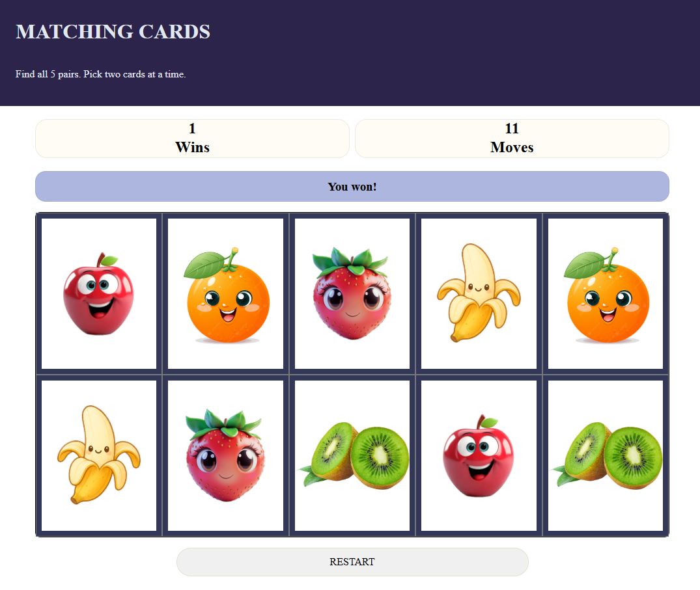

# ♠️ Project: Matching Card Game

### Goal: Make a 10 card memory game - users must be able to select two cards and check if they are a match. If they are a match, they stay flipped. If not, they flip back over. Game is done when all cards are matched and flipped over. Example: http://www.fruit-burst.co.uk/fun-and-games/pairs-game 

### How it looks:

### Features:
- Displays 10 cards with 5 matching fruit pairs
- Randomly shuffles the card layout at the start of every game
- Lets the player reveal two cards at a time
- Keeps matching cards visible
- Hides non-matching cards after a short delay
- Prevents additional clicks while two non-matching cards are being processed
- Tracks completed games in the Wins counter
- Tracks incorrect pair attempts in the Moves counter
- Displays a “You win!” message when all five pairs are found
- Includes a restart button to deal a new randomized deck
- Uses local image files instead of an external API

### How it works:
- The game stores the fruit image filenames in a JavaScript array.
- Each fruit appears twice, creating five possible matches.

### Technologies used:
- HTML5
- CSS3
- JavaScript (ES6)
- setTimeout()
- Google Material Symbols

### No API used:
This project does not fetch data from an API.
Instead, it uses a hard-coded local JavaScript array containing the filenames for the fruit card images

### Future Improvements:
- Track the player’s best score or fewest moves
- Add difficulties leves with more cards
- Add animations for flipping cards

